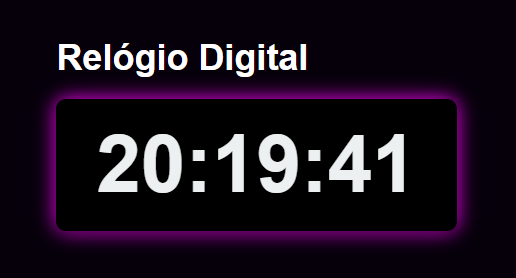

# Relógio Digital

Este projeto é um Relógio Digital responsivo, com estilo moderno e animação de sombra colorida rotativa. Ele exibe a hora em tempo real e utiliza HTML, CSS e JavaScript para sua implementação. A ideia é simples, ideal para quem está aprendendo a integrar estas tecnologias ou deseja um projeto criativo para o portfólio.

## Funcionalidades
- Exibição de horas, minutos e segundos atualizados em tempo real.
- Estilo responsivo, centrado vertical e horizontalmente na tela.
- Efeito de sombra colorida animada ao redor do contêiner do relógio.
- Interface minimalista e elegante.

## Tecnologias Utilizadas
- **HTML5**: Estrutura da página.
- **CSS3**: Estilização e animação.
- **JavaScript**: Atualização dinâmica do horário em tempo real.

## Estrutura do Projeto
```
relogio-digital/
|-- index.html
|-- style.css
|-- script.js
```

### 1. index.html
O arquivo HTML define a estrutura do relógio:
```html
<!DOCTYPE html>
<html lang="en">
<head>
  <meta charset="UTF-8">
  <meta name="viewport" content="width=device-width, initial-scale=1.0">
  <title>Relógio Digital</title>
  <link rel="stylesheet" href="style.css">
</head>
<body>
  <div>
    <h2>Relógio Digital</h2>
    <div id="clock">00:00:00</div>
  </div>
  <script src="script.js"></script>
</body>
</html>
```

### 2. style.css
Este arquivo adiciona estilização e animações:
```css
body {
  font-family: Arial, sans-serif;
  display: flex;
  flex-direction: column;
  justify-content: center;
  align-items: center;
  height: 100vh;
  margin: 0;
  background: #05000a;
  color: #ecf0f1;
}

h2 {
  font-size: 24px;
  margin-bottom: 20px;
}

#clock {
  font-size: 5rem;
  font-weight: bold;
  text-align: center;
  background: #000000;
  padding: 20px 40px;
  border-radius: 10px;
  animation: glow 3s infinite;
}

@keyframes glow {
  0% {
    box-shadow: 0 4px 8px rgba(0, 0, 0, 0.3), 0 0 10px #ff0000;
  }
  25% {
    box-shadow: 0 4px 8px rgba(0, 0, 0, 0.3), 0 0 20px #00ff00;
  }
  50% {
    box-shadow: 0 4px 8px rgba(0, 0, 0, 0.3), 0 0 20px #0000ff;
  }
  75% {
    box-shadow: 0 4px 8px rgba(0, 0, 0, 0.3), 0 0 20px #ff00ff;
  }
  100% {
    box-shadow: 0 4px 8px rgba(0, 0, 0, 0.3), 0 0 10px #ff0000;
  }
}
```

### 3. script.js
O JavaScript atualiza o horário em tempo real:
```javascript
function updateClock() {
  const now = new Date();
  const hours = String(now.getHours()).padStart(2, '0');
  const minutes = String(now.getMinutes()).padStart(2, '0');
  const seconds = String(now.getSeconds()).padStart(2, '0');
  document.getElementById('clock').textContent = `${hours}:${minutes}:${seconds}`;
}

// Atualiza o relógio a cada segundo
setInterval(updateClock, 1000);

// Inicializa o relógio imediatamente ao carregar a página
updateClock();
```

## Como Executar o Projeto
1. Faça o download ou clone o repositório:
   ```bash
   git clone https://github.com/seu-usuario/relogio-digital.git
   ```
2. Navegue até o diretório do projeto:
   ```bash
   cd relogio-digital
   ```
3. Abra o arquivo `index.html` no navegador.

## Screenshot
Adicione uma imagem do projeto funcionando para atrair mais interesse:


## Contribuições
São bem-vindas melhorias ou novas funcionalidades. Abra uma issue ou envie um pull request.

## Licença
Este projeto está licenciado sob a [MIT License](./LICENSE).

